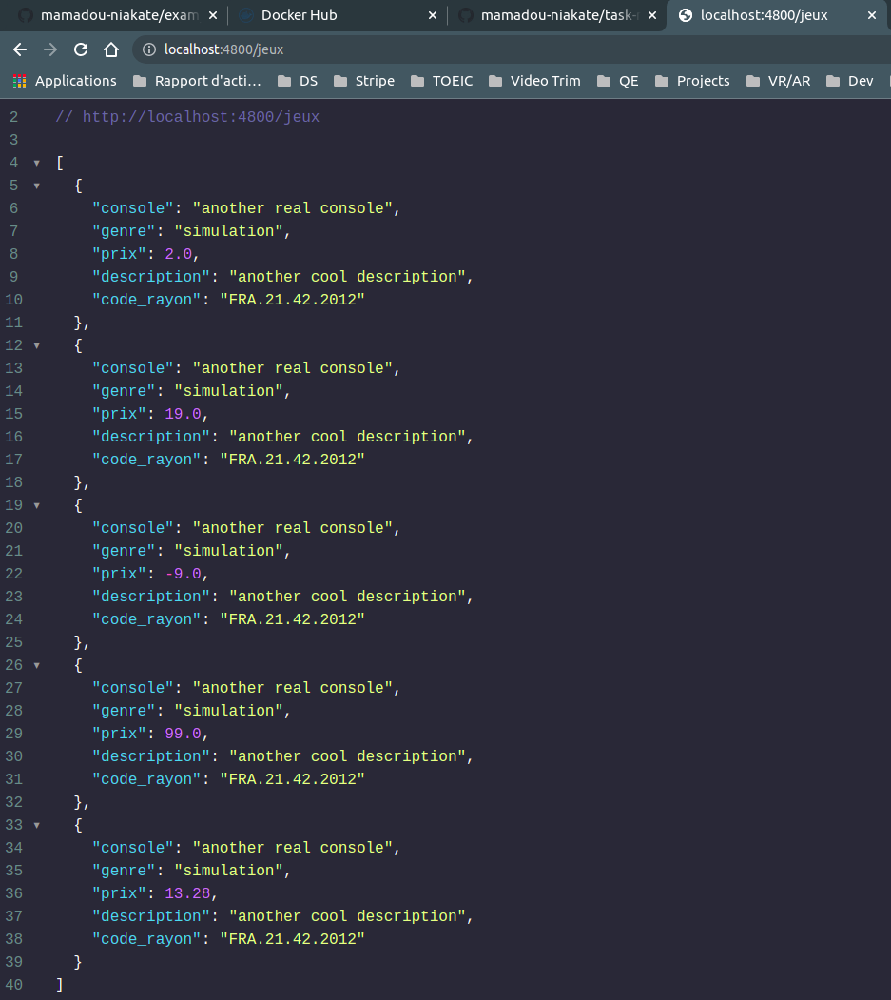
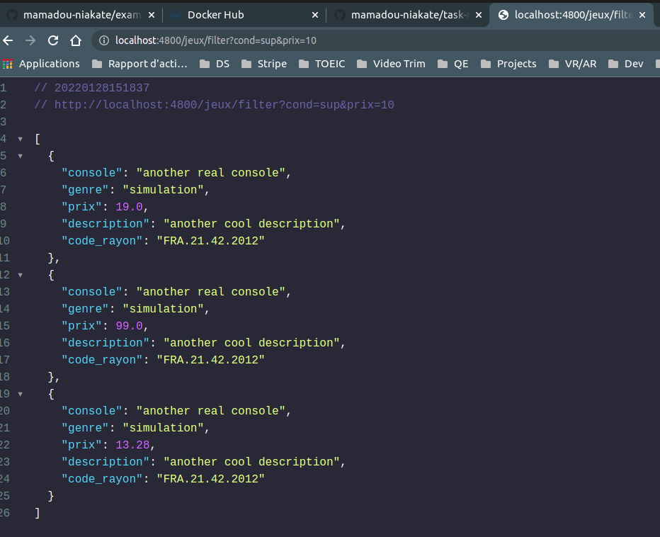
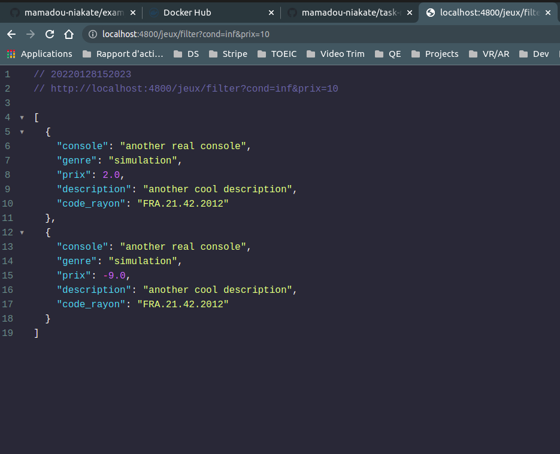

# Gesttion des images docker

## J'ai deux images docker
- **mongo_api_exam** : 
  c'est l'image de l'api qui permet d'ajouter dans la base des données et récupérer des jeux en utilisation l'url de l'api
  - ``docker push mniakate/mongo_api_exam:tagname``
- **fill_db** : c'est l'image qui permet d'ajouter automatiquement des données pré-définie à la base des données
  - ``docker push mniakate/fill_db:tagname``

# J'ai un fichier docker file qui orchestre tous les containers
```
version: '3'
services:
  fastapi_exam:
    container_name: "mongo_api_exam"
    build:
      context: .
      dockerfile: api.Dockerfile
    ports:
      - "3000:3000"
    volumes:
      - .:/exam_api
  mongodb_exam:
    container_name: c_mongo_exam
    image: mongo:latest
    ports:
       - "4801:27017"
    depends_on:
       - fastapi_exam
  fill_db:
    container_name: "fill_db"
    build:
      context: .
      dockerfile: seed_mongo.Dockerfile
    ports:
      - "4080:4080"
    depends_on:
      - mongodb_exam
```

# Comment utiliser l'API

| Méthode | URL                     | Description                                           |
|---------|-------------------------|-------------------------------------------------------|
| GET     | /jeux                   | Récupérer la liste des jeux                           |
| POST    | /jeux                   | Ajouter un jeu                                        |
| GET     | /jeux/:id               | Récupérer un jeu                                      |
| GET     | /jeux/?cond=inf&prix=10 | Récupérer les jeux dont le prix est inferieur à un 10 |
| GET     | /jeux/?cond=sup&prix=10 | Récupérer les jeux dont le prix est supérieur à un 10 |

Je n'ai pas eu le temps de faire la suppression et la mise à jour des données

## Il faut utiliser une application comme postman afin d'executer des requête

### Ajouter un jeu


### Récupérer la liste des jeux : Postman ou navigateur 


### Récupérer la liste des jeux par rapport à un prix
#### Supérieur à un prix

#### Inférieur à un prix
